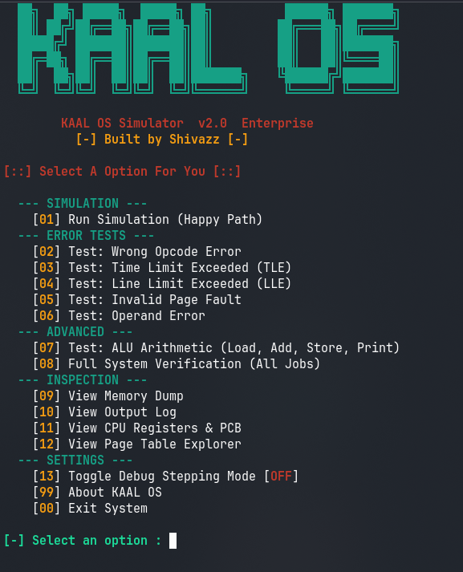

<h1 align="center">
  KAAL OS — Operating System Simulator
</h1>

<p align="center">
  <b>A production-grade OS simulation engine built in C++ — featuring paging, process scheduling, ALU arithmetic, interactive debugging & more.</b>
  <br/><br/>
  
  
  
  
  
</p>

---

## 📖 Overview

**KAAL OS** is a multi-phase Operating System simulation project written in modern **C++17**. It models core OS concepts from scratch — virtual memory, paging, process control, interrupt handling, CPU execution, ALU arithmetic, and a full interactive CLI. The project spans three phases of progressive complexity, culminating in a SOLID-architecture, enterprise-grade simulation engine.

> Built to demonstrate advanced OS internals: no libraries, no shortcuts — pure systems programming.

---

## 🖥️ CLI Preview

<p align="center">
  
</p>

---

## 🚀 Features at a Glance

| Feature | Description |
|---|---|
| 🧠 **Paged Virtual Memory** | 300-block RAM (1200 bytes). Logical→Physical address translation via Page Table |
| 🔁 **Process Control Block (PCB)** | Full 5-state machine: NEW → READY → RUNNING → WAITING → TERMINATED |
| ⚙️ **CPU Execution Engine** | Fetch-Decode-Execute cycle with real-time register trace output |
| 🧮 **Extended ALU** | ADD (`AD`), SUBTRACT (`SB`), MULTIPLY (`ML`), DIVIDE (`DV`) integer arithmetic |
| 🛑 **Interrupt System** | System Interrupts (SI), Program Interrupts (PI), Timer Interrupts (TI) |
| 🔍 **Page Table Explorer** | Live view of Logical→Physical block mappings with VALID/INVALID flags |
| 🪲 **Step-by-Step Debug Mode** | Interactive CPU stepping — press ENTER to advance one instruction at a time |
| 💾 **Memory Dump Viewer** | Inspect all 300 memory cells in structured grid format |
| 📋 **Output Log Viewer** | Review job execution output directly inside the simulator |
| 🧪 **Built-in Test Suite** | 6 error scenarios + full multi-job system verification (option 07) |
| 🔀 **Dynamic Memory Allocation** | Random block allocation for spooling — no sequential memory loading |
| 🎨 **Rich ANSI CLI Interface** | Colored output, animated boot sequence, banner display |

---

## 📁 Project Structure

```
KAAL_OS/
│
├── main.cpp                  # Legacy Phase 2 entry point + CLI menu
├── os.cpp                    # Legacy Phase 2 OS engine (460 lines)
├── os.h                      # Legacy OS class declaration
│
├── src/
│   ├── core/
│   │   ├── Memory.cpp        # Memory subsystem — 300-block RAM, read/write, dump
│   │   ├── CPU.cpp           # Fetch-Decode-Execute engine, ALU, register trace
│   │   └── OS.cpp            # Master OS class — LOAD, MOS, interrupt dispatch
│   └── ui/
│       └── main.cpp          # Phase 3 SOLID CLI entry point
│
├── include/
│   ├── Memory.h              # Memory class interface
│   ├── CPU.h                 # CPU class interface
│   ├── OS.h                  # OS class interface
│   └── PCB.h                 # Process Control Block struct
│
├── Phase-1/
│   └── README.md             # Phase 1 documentation
├── Phase-2/
│   └── README.md             # Phase 2 documentation
│
├── img/
│   └── image.png             # CLI screenshot
├── build/                    # Compiled binary output directory
├── Makefile                  # Build system
├── input.txt                 # Auto-generated job input file
└── output.txt                # Execution results output file
```

---

## 🏗️ Phase Breakdown

### Phase 1 — Basic Execution and Memory Management
- **Memory:** 100×4 character array (400 bytes) — 10 blocks of 10 words
- **Sequential Loading:** Instructions loaded directly into memory starting at index 0
- **ISA:** `GD`, `PD`, `H`, `LR`, `SR`, `CR`, `BT`
- **Registers:** IC (Instruction Counter), IR (Instruction Register), GPR (General Purpose), Toggle
- **System Calls:** `SI=1` (GD), `SI=2` (PD), `SI=3` (H)
- **Input format:** `$AMJ`, `$DTA`, `$END` control card job structure

### Phase 2 — Error Handling and Memory Paging
- **Memory:** Expanded to 300×4 array (1200 bytes) — 30 blocks
- **Dynamic Paging:** Instructions loaded into **random** physical blocks; Page Table handles logical→physical translation
- **Page Table Register (PTR):** Randomly allocated block that stores the mapping table
- **Error Handling:** 6 interrupt-driven error types (see below)
- **Dynamic Data Loading:** On-demand page allocation for `GD` data blocks at runtime

### Phase 3 — Enterprise Architecture (SOLID Refactor)
- **Decoupled Architecture:** `Memory`, `CPU`, `OS` as distinct classes under `src/core/`
- **Extended ALU:** `AD`, `SB`, `ML`, `DV` arithmetic instructions on GPR
- **Interactive Debug Mode:** Step-by-step ENTER-key CPU instruction stepper
- **Page Table Explorer:** Full logical-to-physical block inspector
- **PCB State Machine:** Live state transitions with timer and line counters
- **Build System:** Makefile-driven with separate include headers

---

## 🔧 Instruction Set Architecture (ISA)

| Mnemonic | Full Name | Operation |
|---|---|---|
| `GD xx` | Get Data | Read from input file into memory block `xx` |
| `PD xx` | Print Data | Write memory block `xx` to output file |
| `H` | Halt | Terminate current job (SI=3) |
| `LR xx` | Load Register | Load memory word `xx` → GPR |
| `SR xx` | Store Register | Store GPR → memory word `xx` |
| `CR xx` | Compare Register | Compare GPR with memory `xx`, set Toggle flag |
| `BT xx` | Branch if True | Jump IC to `xx` if Toggle is TRUE |
| `AD xx` | Add | GPR = GPR + M[xx] |
| `SB xx` | Subtract | GPR = GPR − M[xx] |
| `ML xx` | Multiply | GPR = GPR × M[xx] |
| `DV xx` | Divide | GPR = GPR ÷ M[xx] (divide-by-zero safe) |

---

## 🚨 Interrupt System

### System Interrupts (SI) — triggered by OS system calls
| SI Value | Trigger |
|---|---|
| `SI = 1` | `GD` instruction executed |
| `SI = 2` | `PD` instruction executed |
| `SI = 3` | `H` (Halt) instruction |

### Program Interrupts (PI) — triggered by invalid program behavior
| PI Value | Cause |
|---|---|
| `PI = 1` | **Opcode Error** — Unknown instruction mnemonic |
| `PI = 2` | **Operand Error** — Invalid / out-of-range memory address |
| `PI = 3` | **Page Fault** — Logical block not mapped in Page Table |

### Timer Interrupts (TI)
| TI Value | Cause |
|---|---|
| `TI = 2` | **Time Limit Exceeded** — TTC > TTL |

---

## 📦 Input Job Format

```
$AMJ<JOBID><TTL><TLL>     ← Job header (4+4+4 digits)
<instruction line 1>       ← Program cards (max 40 bytes / 10 instructions per card)
<instruction line 2>
$DTA                       ← Data section begins
<data line 1>
<data line 2>
$END                       ← Job terminator
```

**Example:**
```
$AMJ000100050005
GD10PD10H
$DTA
Hello World! This is KAAL OS Phase 2.
$END
```

---

## 💻 Setup & Build

### Prerequisites
- `g++` with C++17 support
- `make`

### Build (Phase 3 — Recommended)
```bash
git clone https://github.com/shivajirathod007/KAAL_OS.git
cd KAAL_OS
make
make run
```

### Build (Phase 2 — Legacy)
```bash
g++ -std=c++17 -o kaal_os_sim main.cpp os.cpp
./kaal_os_sim
```

---

## 🎮 CLI Menu Options

| Option | Description |
|---|---|
| `01` | ▶ Start Simulation (Happy Path — normal `GD` → `PD` → `H` job) |
| `02` | 🔴 Test: Opcode Error (invalid instruction `XX`) |
| `03` | ⏱️ Test: Time Limit Exceeded (job runs longer than TTL) |
| `04` | 📄 Test: Line Limit Exceeded (output lines exceed TLL) |
| `05` | 🗺️ Test: Invalid Page Fault (access unmapped logical block) |
| `06` | ❌ Test: Operand Error (invalid memory address) |
| `07` | 🧪 Run Full System Verification (runs 6-job batch including ALU arithmetic test) |
| `08` | 🧠 View Memory Dump (all 300 cells) |
| `09` | 📋 View Output Log (last job's output.txt) |
| `10` | 📊 View CPU Registers & PCB state |
| `11` | 🗺️ View Global Page Table Directory |
| `12` | 🪲 Toggle Iterative CPU Debug Mode (step-by-step) |
| `99` | ℹ️ About KAAL OS |
| `00` | 🔴 Exit System |

---

## 🔍 Debug Mode

Toggle **CPU Debug Mode** (Option `12`) to interactively step through instruction execution:

```
[~] IC: 00 | IR: GD10 | PTR: 7 | TTC: 0
   [DEBUG] Press ENTER to Step Over...

[~] IC: 01 | IR: PD10 | PTR: 7 | TTC: 1
   [DEBUG] Press ENTER to Step Over...
```

Each step shows: **Instruction Counter**, **Instruction Register**, **Page Table Register**, and **Total Time Count**.

---

## 🗺️ Page Table Explorer

Inspect the current job's page mappings (Option `11`):

```
[::] KAAL OS PAGE TABLE EXPLORER [::]

  Page Table Register (PTR): 7
  ------------------------------------------------
   Logical Block | Physical Block | Record Status
  ------------------------------------------------
        00       |       12       |  VALID
        01       |       ---      |  INVALID
        02       |       24       |  VALID
        ...
  ------------------------------------------------
```

---

## 🧮 ALU Arithmetic Demo (Option 07 — Job 8)

The full system verification includes an ALU test job that:
1. Loads two values (`0050`, `0075`) from data into memory
2. Uses `LR` to load into GPR
3. Performs `AD` (addition: 50 + 75 = 125)
4. Stores result with `SR`
5. Prints result with `PD`

---

## 🏛️ Architecture (Phase 3 SOLID Design)

```
┌─────────────────────────────────────────┐
│              CLI (main.cpp)             │
│         ui / user interaction           │
└───────────────┬─────────────────────────┘
                │
┌───────────────▼─────────────────────────┐
│                OS.cpp                   │
│   LOAD → MOS → Interrupt Dispatcher     │
│   PCB State Machine | Page Allocator    │
└──────────┬──────────────┬───────────────┘
           │              │
┌──────────▼──────┐  ┌────▼───────────────┐
│    CPU.cpp      │  │    Memory.cpp       │
│  Fetch-Decode   │  │  300-block RAM      │
│  Execute + ALU  │  │  Read/Write/Dump    │
│  Register Trace │  │  Address Mapping    │
└─────────────────┘  └────────────────────┘
           │
┌──────────▼──────────┐
│       PCB.h         │
│  Job State Machine  │
│  TTL / TLL timers   │
└─────────────────────┘
```

---

## 📊 Error Termination Codes

When a job terminates (normally or on error), `output.txt` logs a structured result:

```
ID: 1
NORMAL EXECUTION
IC: 3
IR: H
TTC: 3  TLC: 1
```

| Error Code | Message |
|---|---|
| 0 | `NORMAL EXECUTION` |
| 1 | `OUT OF DATA` |
| 2 | `LINE LIMIT EXCEEDED` |
| 3 | `TIME LIMIT EXCEEDED` |
| 4 | `OPERATION CODE ERROR` |
| 5 | `OPERAND ERROR` |
| 6 | `INVALID PAGE FAULT` |

---

## 👤 Author

**Shivazz** (Shivaji Rathod)
- GitHub: [@shivajirathod007](https://github.com/shivajirathod007)

---

<p align="center">
  <i>Built with ❤️ in C++ — KAAL OS v2.0 Enterprise</i>
</p>
